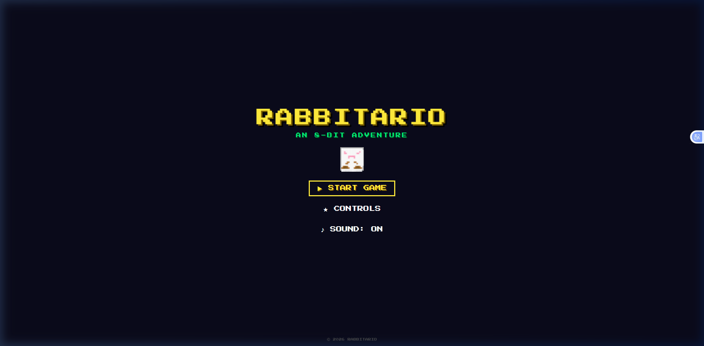
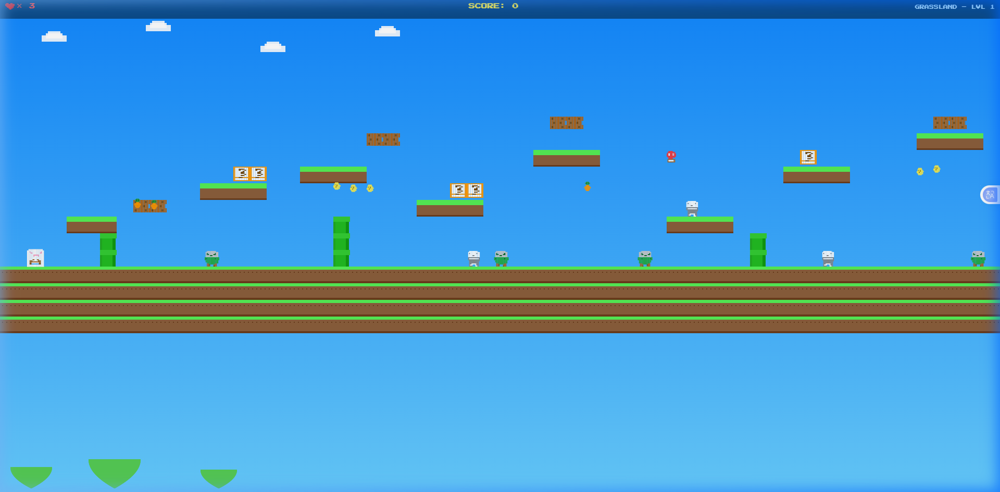
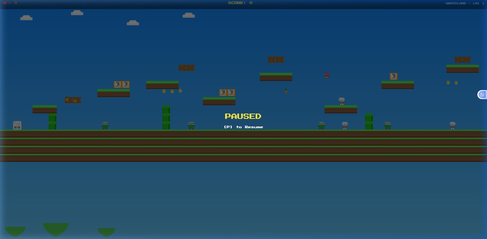

<div align="center">

# 🐰 RABBITARIO

### An 8-Bit Side-Scrolling Platformer Adventure

[](https://daoudz.github.io/rabbitario/)
[](LICENSE)
[](https://developer.mozilla.org/en-US/docs/Web/JavaScript)
[](https://developer.mozilla.org/en-US/docs/Web/API/Canvas_API)

</div>

---

## 📸 Screenshots

### Title Screen


### Gameplay – Grassland Level 1
> Colorful 8-bit grassland with parallax clouds, pipes, platforms, Q-blocks, zombies and skeletons!


### Movement & Interaction


### Jumping & Combat
> Jump on enemies to stomp them! Hit ? blocks from below to reveal coins.



---

## 🎮 About

**Rabbitario** is a classic Mario-style 8-bit side-scrolling platformer built entirely in vanilla HTML5, CSS3, and JavaScript — **no frameworks, no dependencies**.

Guide the brave pixelated rabbit through **3 colorful levels**, stomp terrifying monsters, collect carrots and coins, and defeat the monstrous **Giant Spider Boss** at the end of the final lair!

Every visual, every sound effect, and every music track is generated **in real-time** using the HTML5 Canvas API and the Web Audio API — giving it an authentic 8-bit retro feel.

---

## 🕹️ Controls

| Key | Action |
|-----|--------|
| `←` / `A` | Move Left |
| `→` / `D` | Move Right |
| `↑` / `W` / `Space` | Jump |
| `P` / `Esc` | Pause / Resume |
| `M` | Mute / Unmute |

> 📱 **Mobile Support** — On-screen touch buttons appear automatically on mobile/tablet devices.

---

## 🌍 Levels

### Level 1 – 🌿 Grassland
A bright, cheerful world filled with rolling hills, parallax clouds, and green pipes.
- **Enemies:** Zombies & Skeletons
- **Obstacles:** Platforms, gaps, pipes
- **Reach the flag at the end to advance!**

### Level 2 – 🦇 Dark Cave
A foreboding underground cavern with dangerous pit gaps and eerie floating enemies.
- **Enemies:** Skeletons & Flying Dragons
- **Obstacles:** Pit gaps with water/lava, ceiling stalactites, narrow paths
- **Survive the darkness and reach the exit!**

### Level 3 – 🕷️ Boss Lair
The ultimate showdown in a volcanic lair. A fearsome Giant Spider Boss awaits!
- **Enemies:** All previous types + **The Giant Spider Boss**
- **Boss has 2 phases** — speeds up and becomes aggressive at half health
- **Stomp the boss 6 times to win the game!**

---

## 👾 Enemies

| Enemy | Behavior | Points |
|-------|----------|--------|
| 🧟 **Zombie** | Patrols left/right, turns at edges | 100 |
| 💀 **Skeleton** | Faster patrol, turns at edges | 200 |
| 🐉 **Flying Dragon** | Flies in sine-wave pattern | 300 |
| 🕷️ **Giant Spider Boss** | Chases player, jumps periodically, 2-phase AI | 500 |

---

## 🍄 Collectibles & Power-ups

| Item | Description | Points |
|------|-------------|--------|
| 🥕 **Carrot** | Classic collectible | +50 |
| 🪙 **Coin** | Found in the air or from ? blocks | +100 |
| 🍄 **Mushroom** | Makes you **BIG** — survive one hit & smash bricks | +200 |

---

## 🧱 Block Types

| Block | Effect |
|-------|--------|
| **? Block** | Hit from below to reveal a coin |
| **Brick Block** | Decorative; smashes if you're Big |
| **Ground Tile** | Solid footing |
| **Platform** | One-way; jump up through |
| **Pipe** | Solid obstacle |

---

## 🔊 8-Bit Audio

All sound is **procedurally generated** using the **Web Audio API** — zero audio file downloads required.

### Sound Effects
| Event | Sound |
|-------|-------|
| Jump | Rising square-wave chirp |
| Stomp | Noise burst + low thud |
| Collect Coin/Carrot | 3-note ascending arpeggio |
| Mushroom Power-Up | 5-note fanfare |
| Player Hit | Noise burst |
| Player Death | 4-note descending phrase |
| Level Clear | 4-note ascending fanfare |
| Game Over | Slow descending phrase |
| Boss Stomp | Sawtooth bass descent |

### Background Music
Each level has its own unique 8-bit melody + bass track:
- **Level 1** – Bright, upbeat major key melody (160 BPM)
- **Level 2** – Dark, minor-mode atmosphere (140 BPM)
- **Level 3** – Intense boss track (180 BPM)

---

## 🏗️ Architecture

This is a pure vanilla HTML/CSS/JS project — no build tools, no bundlers, no libraries.

```
rabbitario/
├── index.html           # Game shell, screens (title/gameover/win/levelclear)
├── style.css            # 8-bit UI styling (Press Start 2P font, animations)
└── js/
    ├── audio.js         # Web Audio API 8-bit engine (SFX + music synthesis)
    ├── sprites.js       # Hand-coded pixel art (canvas pixel grid renderer)
    ├── tiles.js         # Tile renderer + 3 parallax backgrounds
    ├── entities.js      # Player, Zombie, Skeleton, Dragon, Boss, Collectibles
    ├── levels.js        # Level definitions (tilemap, enemy/item spawn positions)
    └── game.js          # Main game loop, camera, HUD, state machine
```

### Key Technical Details
- **Game Loop**: `requestAnimationFrame` at 60 FPS with delta-time clamping
- **Rendering**: HTML5 `<canvas>` with `imageSmoothingEnabled = false` for crisp pixels
- **Physics**: Custom AABB tile collision, variable-height jumping, gravity
- **Camera**: Smooth lerp follow camera with world bounds clamping
- **Pixel Art**: All sprites drawn as code — 16×16 pixel grids mapped to canvas
- **Audio**: Oscillator nodes (square/triangle/sawtooth) + noise buffers; melody/bass scheduling via `setTimeout`

---

## 🚀 Running Locally

No installation needed. Just serve the folder over HTTP:

**Python (recommended):**
```bash
cd rabbitario
python -m http.server 3900
# Open http://localhost:3900
```

**Node.js:**
```bash
npx serve .
```

**VS Code**: Use the [Live Server](https://marketplace.visualstudio.com/items?itemName=ritwickdey.LiveServer) extension.

> ⚠️ Opening `index.html` directly as a `file://` URL works too, but a local server is recommended.

---

## 🌐 Play Online

Enable **GitHub Pages** to host the game publicly for free:

> Repo → **Settings** → **Pages** → Source: `main` branch → **Save**

Once live: `https://daoudz.github.io/rabbitario/`

---

## 📝 License

MIT License — free to use, modify, and share. See [LICENSE](LICENSE) for details.

---

<div align="center">

**Made with 🐰 and lots of 8-bit love**

*© 2026 Rabbitario*

</div>
